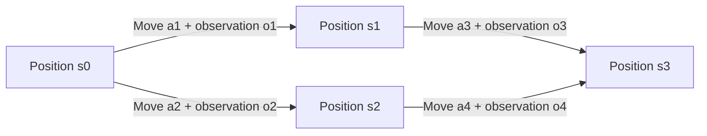
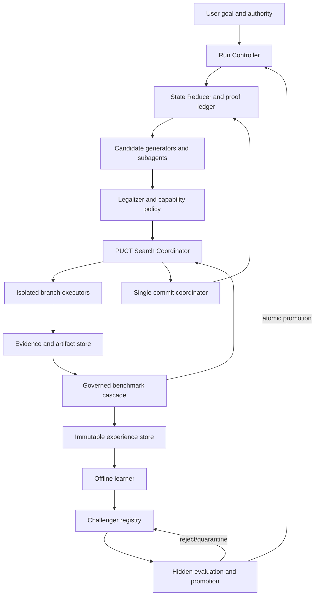

# Agent Tree RL

## AlphaZero-inspired constrained expert iteration for inter-agent decisions

- Status: original technical design plus executable synthetic reference
- Design date: 2026-07-13
- Audience: agent-platform, evaluation, safety, infrastructure, and product teams

---

## 1. Executive decision

Build this as **constrained expert iteration**, not literal AlphaGo self-play.

The system represents every material proposal, question, answer, critique,
probe, revision, merge, and commitment as a typed move. A move transforms a
versioned decision position just as a legal chess move transforms a board
position. A PUCT/MCTS controller searches these moves. Governed benchmarks
evaluate resulting branches. An offline learner trains a bounded challenger
policy/value overlay from search visits and independently observed outcomes.

The system may learn which agent, tool, proof surface, or action template to try
next. It may not autonomously change:

- the user goal;
- authorization or permissions;
- safety and privacy gates;
- benchmark cases, weights, or evaluator code;
- its own promotion criteria;
- the current run's frozen policy;
- external state during hypothetical rollouts.

The optimal production decision is therefore not “the branch with the largest
single weighted sum.” It is:

1. a branch legal under current authority;
2. a branch passing every non-compensable gate;
3. a branch with current required proof;
4. the highest robust quality estimate among eligible branches;
5. the lowest cost among branches that are statistically equivalent.

This preserves AlphaZero's useful loop—policy-guided search produces a stronger
policy target—without pretending that open-world agent work has Go's finite
actions, perfect state, cheap simulator, or objective win/loss label.

---

## 2. Problem statement

Today's agent systems often coordinate through unstructured transcripts. That
creates four failures:

1. A statement, a decision, and an executed side effect can look identical.
2. Majority agreement can masquerade as evidence.
3. The orchestrator cannot replay why one branch won.
4. Feedback improves prompts informally rather than producing a measured,
   reversible policy update.

We need a controller that can:

- treat Q&A and deliberation items as replayable decision-tree moves;
- compare branches using weighted, versioned benchmarks;
- route work among agents and subagents based on measured performance;
- bench or quarantine weak agents without deadlocking or silently bypassing the
  quarantine;
- learn from outcomes while preventing reward hacking and unsafe self-modification;
- use local, production-like, and hosted proof surfaces as complementary evidence;
- remain fast and economical enough for present-day LLM and tool costs.

### 2.1 Meaning of “self-evolve”

In this design, self-evolution means bounded adaptation of controller artifacts:

- action-template priors;
- agent/model/tool routing;
- branch-budget allocation;
- value and cost prediction;
- context assembly policy;
- optional prompt or ranker challengers promoted through external gates.

It does not mean self-rewriting runtime code, granting new capabilities, moving
benchmark goalposts, or promoting a new model without a separate control plane.

### 2.2 Meaning of “optimal”

Open-world agent systems cannot prove a global optimum because the candidate
generator may never propose the best action and the world is only partially
observed. “Optimal” means the best robust branch among generated legal
candidates under a frozen objective, budget, evidence snapshot, and uncertainty
model. Every result must report candidate coverage and sensitivity rather than
claiming universal optimality.

---

## 3. Goals and non-goals

### 3.1 Goals

- One immutable envelope for all decision-relevant inter-agent moves.
- Pure, replayable state transitions.
- Constraint-first, vector-valued branch evaluation.
- Dynamic-action PUCT with progressive widening.
- Cooperative multi-agent debate organized around falsifiable claims and tools.
- Bounded offline policy/value learning.
- Task-stratified agent reliability, weighting, shadowing, and benching.
- Evidence provenance, freshness, and dependency invalidation.
- One serialized commit authority for external mutations.
- Deterministic replay of decision records, even when execution cannot be replayed.
- Champion/challenger promotion with rollback.
- Explicit handling of unknown, censored, stale, and conflicting outcomes.
- Practical cost, latency, and context controls.

### 3.2 Non-goals for the first production increment

- Foundation-model pretraining or unconstrained fine-tuning.
- Token-level MCTS over natural-language generation.
- Treating critic agents as a literal opposing chess player.
- Letting agents vote a fact into truth.
- Parallel speculative external writes.
- Automatically generated benchmarks entering training without validation.
- Semantic state merging based only on embeddings or an LLM judgment.
- A generic autonomous organization that recursively spawns without bounds.
- Persisting hidden chain-of-thought.

### 3.3 Prototype non-goals

The included prototype intentionally excludes real LLM calls, persistence,
concurrency, neural networks, a transposition table, external effects, and
statistically valid promotion. It tests the state/search/benchmark/learning
mechanics only.

---

## 4. Why AlphaZero rather than literal AlphaGo

The transferable pattern is:

1. a policy proposes promising moves;
2. search spends extra computation to improve the decision;
3. a value function estimates unfinished branches;
4. grounded terminal outcomes supervise both policy and value;
5. a stronger challenger replaces the champion only after evaluation.

The analogy breaks in important ways:

| Go or chess | Agent work |
|---|---|
| Finite legal moves | Open-ended language and tool actions |
| Fully observed board | Partial, stale, permission-scoped evidence |
| Deterministic transition | Tools, humans, networks, and tests are stochastic |
| Cheap exact simulator | Rollouts can cost money or cause effects |
| Stable rules | Goals, code, tools, and environments drift |
| Objective terminal result | Multi-objective, delayed, sometimes subjective outcome |
| Zero-sum opponents | Mostly cooperative specialized roles |
| Millions of self-play games | Sparse, heterogeneous, privacy-bound traces |

Consequences:

- Use a constrained partially observable stochastic semi-MDP.
- Generate small typed action sets and progressively widen them.
- Execute reversible probes in real sandboxes; cap imagined rollout influence.
- Store value vectors and uncertainty rather than only a scalar.
- Never alternate reward sign merely because agent roles alternate.
- Model chance outcomes and censored failures explicitly.
- Re-root after each real action because the world has changed.
- Keep evaluator authority outside the learned loop.

---

## 5. Formal model

Represent an episode as:

\[
\mathcal{M}=(S,A,O,T,Z,R,C,H,\gamma,B)
\]

where:

- \(S\) is the structured decision or belief state;
- \(A(s)\) is the dynamically generated legal move set;
- \(O\) is evidence observed from tools, agents, users, or environments;
- \(T(s'\mid s,a,o)\) is the stochastic transition;
- \(Z(o\mid s,a)\) is the observation model;
- \(R\) is the vector of quality outcomes;
- \(C\) is the vector of token, latency, money, mutation, and risk costs;
- \(H\) is the set of hard constraints;
- \(\gamma\) is normally 0.98–1.0 for finite agent episodes;
- \(B\) is the externally enforced resource budget.

The soft objective is:

\[
\max_\pi\;\mathbb{E}_\pi[w^T G-\lambda^T C]
\]

subject to:

\[
H(s,a,o)=\text{true},\qquad C_j\le B_j
\]

Authorization, critical safety, privacy, tenant isolation, irreversible-effect
approval, and mandatory proof are constraints, not finite negative weights.

### 5.1 Semi-MDP timing

Moves can take milliseconds or hours. Each edge records elapsed wall time and
resource cost. Time-dependent returns use duration-aware discounting when useful:

\[
G_t=r_t+\gamma^{\Delta t_t}G_{t+1}
\]

For most bounded engineering tasks, undiscounted terminal quality plus explicit
cost is clearer than aggressive temporal discounting.

### 5.2 Cooperative backup

All solver, critic, verifier, and steward moves contribute to one task outcome.
Backpropagate the same return through the path:

\[
N(s,a)\leftarrow N(s,a)+1
\]

\[
W_k(s,a)\leftarrow W_k(s,a)+G_{t,k}
\]

\[
Q_k(s,a)=W_k(s,a)/N(s,a)
\]

A locally adversarial red-team subgame may use its own reward, but its result
must map back to the shared task value. Do not negate value on every ply as a
two-player board-game engine would.

---

## 6. Core domain model

### 6.1 Position, move, observation, and edge statistics

The chess invariant is:

```text
position_before + legal_move + observed_transition = position_after
```

A move is not a state. A node contains a position. An edge contains a move and
its observation. Search statistics are mutable but do not mutate the immutable
move.



The UI may show a tree. Storage should share `S3` as a transposition only when
all decision-relevant fields match.

### 6.2 Tree item envelope

Every decision-relevant contribution uses one envelope:

```json
{
  "id": "move_01J...",
  "run_id": "run_01J...",
  "root_id": "root_01J...",
  "parent_edge_id": "edge_01J...",
  "ply": 4,
  "type": "ANSWER",
  "position_before_hash": "sha256:...",
  "goal_version": "goal-v3",
  "actor": {
    "agent_id": "verifier-2",
    "role": "verifier",
    "model": "provider/model-snapshot",
    "prompt_hash": "sha256:...",
    "lineage_id": "lineage:..."
  },
  "action": {
    "kind": "RUN_PROBE",
    "target_question_id": "question_17",
    "arguments": {"probe_id": "android-lifecycle-narrow"},
    "preconditions": ["workspace_hash_matches", "read_capability_valid"],
    "expected_patch": {"proof_obligations_remove": ["lifecycle-ready"]},
    "estimated_cost": {"tokens": 0, "seconds": 90, "money_usd": 0.0},
    "risk_class": "READ_ONLY"
  },
  "observation": {
    "status": "PASS",
    "summary": "Canonical probe reached stable controls",
    "environment_hash": "sha256:...",
    "artifact_refs": ["artifact://trace/abc"],
    "observed_at": "2026-07-13T00:00:00Z"
  },
  "evidence_refs": ["evidence://abc"],
  "position_after_hash": "sha256:...",
  "benchmark_receipt_refs": ["receipt://bench/xyz"],
  "created_at": "2026-07-13T00:00:02Z"
}
```

Human-readable prose belongs in a `summary` or `rationale` field. It does not
define legality, semantic identity, or reward. This prevents verbosity and
rephrasing from creating fake novelty.

### 6.3 Move vocabulary

Use a small grammar first:

```text
ASK
ANSWER
PROPOSE
DELEGATE
INSPECT
RUN_PROBE
RUN_TEST
CHALLENGE
SUPPORT
FALSIFY
REBUT
REVISE
CONCEDE
MERGE
VERIFY
CLASSIFY_BLOCKER
COMMIT
BACKTRACK
REQUEST_AUTHORITY
WAIT_FOR_USER
ABSTAIN
ABORT
```

Agent/model/tool selection is part of the move parameters and can be learned.
Capabilities are not. The legalizer attaches capabilities based on policy after
the move is selected.

### 6.4 Q&A mapping

- `ASK(question_id)` adds an open proof or decision obligation.
- `ANSWER(question_id, claim, evidence_refs)` is legal only when that question
  is open and cited evidence is admissible.
- Multiple exclusive answers are sibling edges.
- Compatible answers combine through `MERGE(answer_ids)`.
- A critique opens a falsification obligation; it does not become true merely
  because it was asserted.
- A user-authority question creates `WAIT_FOR_USER`. Hypothetical answers may be
  explored in a marked simulation but never committed or trained as factual.
- Pure commentary that changes no state is an annotation, not a move and not a
  learning signal.

### 6.5 Position contents

A position is a compact structured belief state, not the whole transcript:

```text
Position
  task_id, task_version, goal_version
  requirement_ledger[]
  artifact_snapshot_hashes[]
  environment and transport fingerprints[]
  confirmed_claims[] -> evidence IDs
  assumptions[] -> confidence and falsifier
  contradictions[]
  open_questions[]
  proof_obligations[]
  committed_decisions[]
  pending and completed effects[]
  available agents/tools/capabilities[]
  policy/model/prompt/evaluator/schema versions
  budget_remaining
  privacy and tenant scope
  cancellation and lease state
```

Two states with similar summaries are not equivalent when credentials, pending
effects, user authority, tool versions, evidence freshness, cost, or history-
dependent constraints differ.

### 6.6 Evidence record

```text
Evidence
  id
  source type and URI
  content hash
  raw artifact reference
  parsed value and parser version
  environment fingerprint
  trust tier
  taint labels
  observed_at, expires_at
  dependency hashes[]
  claims supported[]
  claims contradicted[]
  signature/attestation
```

Evidence is current only if its TTL, dependency hashes, tool version, artifact
snapshot, and authority scope still match. A later edit invalidates dependent
proof explicitly.

### 6.7 Mutable search statistics

```text
EdgeStats
  N                         visit count
  W[metric]                 cumulative value vector
  Q[metric]                 mean value vector
  prior                     frozen for this run
  value_uncertainty
  expected_information_gain
  measured_cost distribution
  invalid/timeout/censored counts
  virtual_loss              parallel search only
```

Statistics are keyed by policy, benchmark, evaluator, task, and state versions.
Never mix Q-values produced under incompatible reward profiles.

---

## 7. Logical tree, physical DAG

The conversation view is naturally a tree: each reply has a parent. Execution
is a DAG because branches can reach the same state, independent subtasks join,
and one observation can invalidate several descendants.

### 7.1 Transposition rule

Two positions may share a cached evaluation only when their canonical hashes
match across all decision-relevant fields. Use exact structured hashes, not
embedding similarity. Preserve edge-specific cost and provenance even when the
resulting state is shared.

When semantic state matches but remaining budgets differ, keep Pareto labels.
One route dominates another only if it is no worse on all relevant costs,
freshness, risk, and authority fields.

### 7.2 Fork and join

- Each parallel branch reads an immutable snapshot.
- Required and optional child results are declared before the join.
- A join uses compare-and-swap against goal and artifact versions.
- Late results attach to their original snapshot as candidate evidence.
- Conflicts require a typed `MERGE`, `REBASE`, or escalation move.
- Never use silent last-writer-wins.

### 7.3 Cycle identity

Detect loops using:

```text
hash(goal_version, state_digest, action_class, hypothesis, recovery_path, environment_class)
```

Repeated prose with no new trusted evidence is no progress. After two identical
dead-end attempts, mask that recovery edge and require:

```text
CLASSIFY_BLOCKER(product | harness/bootstrap | transport/environment | hosted/infra)
```

Then pivot to a different evidence surface or terminate explicitly.

---

## 8. Inter-agent discussion protocol

### 8.1 Roles

| Role | Responsibility | Forbidden shortcut |
|---|---|---|
| Orchestrator | Own state, legality, budgets, tree, and commit authority | Treat transcript consensus as state truth |
| Scout/proposer | Generate distinct candidate actions | See hidden evaluator answers |
| Skeptic/critic | State falsifiable risks and decisive tests | Win by rhetorical confidence |
| Verifier | Obtain trusted evidence and classify uncertainty | Grade its own unsupported claim |
| Builder | Estimate implementation and reversibility | Mutate shared state during search |
| Steward/decider | Choose eligible branch or abstain | Override gates for weighted utility |
| Red team | Search for counterexamples and injections | Change production objective |
| Human/user | Resolve intent and grant authority | Be simulated as if approval were factual |

One agent can fill several roles for cheap tasks, but the trace preserves the
role used on each move.

### 8.2 Debate sequence

For an important decision:

1. Parse the goal, constraints, authority, and proof obligations.
2. Generate 3–4 proposals independently.
3. Lock proposals before peers see them to reduce anchoring.
4. Deduplicate by structured action signature and retain meaningful diversity.
5. Ask critics for a falsifier or executable counterexample, not a confidence vote.
6. Prefer a narrow real probe over another prose round.
7. Allow explicit revision, concession, and merge moves.
8. Run an independent verifier on the leading eligible branches.
9. Perform sensitivity and uncertainty checks.
10. Commit through one serialized executor or choose `ABSTAIN`/`WAIT_FOR_USER`.

Every substantive proposal contains:

- claim or action;
- assumptions;
- expected outcome;
- required preconditions;
- evidence already available;
- decisive falsifier or proof;
- confidence and uncertainty type;
- predicted token, latency, money, and risk cost;
- reversibility/compensation plan.

Persist this concise rationale, not hidden chain-of-thought.

### 8.3 Correlation-aware discussion

Five copies of one model reading one flawed summary are not five independent
votes. Track a lineage fingerprint containing model family, prompt family,
evidence sources, tools, and ancestor outputs. Blind reviewers to proposer
identity and order when possible.

Approximate effective sample size for average pairwise correlation \(\rho\):

\[
N_{eff}\approx\frac{N}{1+(N-1)\rho}
\]

Use `N_eff` for confidence, not raw agent count. Reward new evidence and valid
counterexamples more than verbal agreement.

---

## 9. Candidate generation and legal moves

### 9.1 Dynamic action interface

```text
ActionGenerator.generate(position, legal_kinds, branch_budget)
  -> candidate move drafts

Legalizer.validate(position, draft)
  -> legal move | rejection reason
```

Agents return strict structured output. The orchestrator validates:

- move kind allowed in the current phase;
- parent state and goal versions current;
- referenced question open;
- evidence refs exist and are admissible;
- capability requested no broader than policy allows;
- cost reservation available;
- depth, branch, and spawn limits respected;
- action not duplicate, cyclic, stale, or already dead twice;
- external effect has required user authority;
- arguments satisfy tool schema.

An invalid generation is an observation about the generating policy, not a move
in executable state.

### 9.2 Progressive widening

Natural language has no finite move list. Limit expanded actions:

\[
|A_{expanded}(s)|\le\min(A_{max},k_0+\alpha N(s)^\beta)
\]

Practical defaults:

- `k0 = 3` independently generated candidates;
- `alpha = 1`;
- `beta = 0.5`;
- `Amax = 8` for routine work, 12 for high-impact offline search;
- depth 4–8 material decision moves;
- one novelty expansion only after existing candidates receive visits.

Do not branch on every sentence or token. Branch at material decision boundaries:
strategy, hypothesis, evidence surface, implementation, verification, and commit.

### 9.3 Candidate coverage

Search cannot discover an action no generator proposes. Report:

- generators and versions queried;
- number of candidates before/after deduplication;
- diversity dimensions covered;
- rejected candidate reasons;
- remaining uncertainty;
- whether an exploration quota was used.

Preserve a small prior floor and novelty quota so a learned prior cannot
permanently suppress unfamiliar correct actions.

---

## 10. Search algorithm

### 10.1 Constrained PUCT

Filter hard-illegal actions first. Score each remaining expanded edge:

\[
a^*=\arg\max_a[
Q_{robust}(s,a)
+c_{puct}P_\theta(a\mid s)\frac{\sqrt{\sum_bN(s,b)}}{1+N(s,a)}
+\kappa\sigma_{ep}(s,a)
+\eta I(s,a)
-\lambda_c\frac{\hat C(s,a)}{B_{remaining}}
-L_{virtual}(s,a)]
\]

where:

- `Qrobust` is a lower-confidence or risk-adjusted value;
- `P` is the policy prior over the current candidate set;
- `sigma_ep` is epistemic uncertainty, useful for exploration;
- `I` is expected information gain, useful for diagnostic probes;
- `C` is trusted predicted cost;
- `virtual loss` prevents parallel workers from selecting one leaf.

Reasonable starting values after normalization:

- `c_puct = 1.5`;
- root Dirichlet noise fraction `0.15–0.25` in offline training only;
- no noise and temperature near zero for production commitment;
- uncertainty bonus only for reversible/read-only exploration;
- cost penalty small enough that mandatory proof cannot be skipped.

### 10.2 Simulation lifecycle

Each simulation performs:

1. **Select** legal edges with constrained PUCT.
2. **Expand** a new structured move within progressive-widening limits.
3. **Execute** only read-only or isolated reversible probes.
4. **Observe** exact artifacts, environment identity, and trusted cost.
5. **Evaluate** with deterministic checks first and independent judges last.
6. **Back up** the value vector and outcome status.

Model-only hypothetical rollouts carry a `SIMULATED` trust label. Cap their
depth and influence. Never backpropagate a hallucinated tool success as if it
were observed.

### 10.3 Proof cascade

Use the cheapest decisive evidence first:

1. schema and legal-action validation;
2. static or deterministic inspection;
3. canonical narrow local/emulator probe;
4. focused task test;
5. independent verifier review;
6. broader local regression;
7. connected device or production-like target;
8. hosted/cloud automation;
9. human acceptance for irreducible intent or authority.

Local/emulator, real device/production-like, and hosted surfaces provide
different facts. A pass on one does not automatically substitute for another.

### 10.4 Chance nodes and flaky tools

Network calls, tests, and LLM generations are stochastic. Represent outcome
branches explicitly. For repeated result \(j\), use a lower confidence bound:

\[
LCB_j=\hat\mu_j-z_\alpha\frac{\hat\sigma_j}{\sqrt{n_{eff}}}
\]

One lucky retry is not proof. Infra failures are `UNKNOWN/CENSORED`, not product
failures. The two-dead-end rule prevents repeated blind retries.

### 10.5 Commit selection

Exploration can be optimistic; commitment must be conservative. Use:

\[
Q_{commit}=\mu_Q-\rho\sigma_Q
\]

or conditional value at risk for high-impact tasks. Select in lexicographic order:

1. feasible under gates;
2. highest robust quality;
3. current proof coverage complete;
4. lowest cost among statistically tied candidates;
5. deterministic stable-ID tie-break.

If confidence intervals overlap materially or weights are sensitive, present
alternatives or ask the user. Do not manufacture certainty.

### 10.6 Re-rooting

After each real committed move:

- capture the new artifact/environment snapshot;
- re-root search at the actual resulting state;
- preserve descendants only when their hashes and evidence remain valid;
- cancel or quarantine stale workers;
- re-reserve budgets;
- never confuse a hypothetical child with the real workspace.

---

## 11. Weighted and benchmarked value

### 11.1 Vector first, scalar second

Store raw values such as:

```text
correctness
requirement coverage
evidence/proof coverage
robustness
maintainability
user-intent fit
reversibility
latency
token cost
money cost
external-effect risk
uncertainty
```

A software-task starting profile might use these soft weights:

| Metric | Weight |
|---|---:|
| Correctness | 0.35 |
| Evidence coverage | 0.20 |
| Robustness | 0.15 |
| Maintainability | 0.10 |
| User-intent fit | 0.10 |
| Efficiency | 0.10 |

Safety, authorization, scope, privacy, required tests, and irreversible-effect
approval remain hard gates. The prototype uses a documented synthetic profile
optimized for an Android-test decision; it is not a universal default.

### 11.2 Benchmark specification

```text
BenchmarkSpec
  immutable ID and version
  target task families and strata
  cases and frozen case weights
  hard gates
  metric definitions and normalization
  stochastic repetitions
  evaluator and tool versions
  train/dev/hidden/rotating-live partitions
  maximum cost and latency
  protected regression strata
  champion reference
  confidence and stopping rules
```

Benchmark weights are approved configuration. They do not learn online. Store
the vector so a new approved profile can rescore old outcomes without pretending
old Q-values are compatible.

### 11.3 Intermediate reward

Do not reward discussion length, confidence, citations, or agreement. If sparse
terminal reward slows learning, use potential-based shaping:

\[
r'(s,a,s')=r(s,a,s')+\gamma\Phi(s')-\Phi(s)
\]

Good potentials include verified requirements closed, uncertainty reduced,
stale evidence refreshed, and decisive counterexamples found. This preserves
the terminal optimum when implemented correctly.

### 11.4 Sensitivity

Re-evaluate finalists under plausible weight perturbations. If a small change
flips the winner, mark the decision `WEIGHT_SENSITIVE`. A production controller
should return the Pareto frontier and the disputed tradeoff, not hide it behind
three decimal places.

### 11.5 Benchmark gaming controls

- Task selection is external to the challenger.
- Hidden expected outputs never enter proposer context or training traces.
- Evaluators are versioned and read-only to the run.
- Deterministic proof outranks LLM judgment.
- Candidate content is delimited as untrusted data for LLM judges.
- Query limits prevent reconstruction of hidden answers.
- Timeouts, refusals, and blocked outcomes are reported as separate strata.
- Optional stopping and multiple-candidate selection are predeclared.
- Aggregate gains cannot conceal protected-stratum regressions.
- Anti-gaming cases measure concise correctness, useful safe completion, and
  resistance to grader injection.

---

## 12. Policy and value architecture

A fixed board-game policy head cannot enumerate arbitrary text actions. Split it:

```text
ActionGenerator(position) -> candidate move drafts
ActionRanker(position, move) -> policy logit and uncertainty
ValueModel(position) -> metric vector and uncertainty
CostModel(position, move) -> resource distribution
```

For candidate moves \(a_i\):

\[
P_\theta(a_i\mid s)=\frac{\exp(f_\theta(s,a_i)/T)}{\sum_j\exp(f_\theta(s,a_j)/T)}
\]

### 12.1 Practical first learner

Start with a contextual bandit or small linear/tree ranker over structured
features:

- task family and risk class;
- decision phase and move kind;
- agent role/model/tool/surface;
- reversible vs destructive;
- proof available vs missing;
- blocker classification;
- cost bucket;
- uncertainty and evidence freshness;
- branch history summarized structurally.

Do not train on raw scenario IDs or free-text tokens in the first learner; that
would memorize fixtures. Fine-tune a foundation model only after the trace,
benchmark, leakage, and promotion pipeline is trustworthy.

### 12.2 AlphaZero-style targets

Convert root visit counts to the policy target:

\[
\pi_t(a)=\frac{N(s_t,a)^{1/\tau}}{\sum_bN(s_t,b)^{1/\tau}}
\]

Use independently validated outcome \(z\) for the value target. A composite
training objective can be:

\[
\mathcal{L}=
-\pi^T\log p_\theta
+\lambda_v\operatorname{Huber}(v_\theta,z)
+\lambda_{cal}\operatorname{Brier}(p_{success},y)
+\lambda_{rank}\mathcal{L}_{pairwise}
+\lambda_{cost}\mathcal{L}_{cost}
+\lambda_{reg}\|\theta\|^2
\]

Useful targets:

- policy: MCTS visit distribution;
- value: delayed grounded metric vector;
- rank: sibling branch advantage;
- calibration: actual success/failure;
- cost: trusted metering;
- critic credit: verified counterexample or increase in root decision quality.

### 12.3 Credit assignment

One final success does not prove every ancestor was good. Use:

- local deterministic receipts;
- temporal-difference advantage;
- sibling counterfactuals on replayable tasks;
- offline leave-one-out for high-value traces;
- explicit credit for evidence that changes the decision;
- censored labels for ambiguous external outcomes.

Do not use eloquence, confidence, or number of replies as contribution measures.

### 12.4 Bounded updates

- Freeze all policy/value weights for an episode.
- Update only between episodes.
- Clip coordinates and per-episode movement.
- Reject NaN, infinity, schema mismatch, or reward-version mixing.
- Keep the exact pre-update snapshot.
- Train a challenger artifact; never overwrite the champion in place.
- Evaluate held-out task families and protected strata.
- Roll back automatically on failed promotion.

The prototype clips a tiny in-memory feature overlay and never persists it. A
production system stores immutable model artifacts in a registry.

---

## 13. Agent weighting and benching

Agent reliability changes routing prior and branch budget. It never turns an
unsupported claim into evidence.

### 13.1 Reliability model

Estimate reliability by:

- task family;
- move class;
- risk class;
- environment/tool surface;
- model and prompt version;
- outcome freshness window.

For binary receipts, a Beta posterior is a useful baseline:

\[
p_{agent,stratum}\sim\operatorname{Beta}(\alpha,\beta)
\]

Use effective independent sample count after lineage correlation adjustment.
For continuous outcomes, model calibrated mean, variance, tail failure, and
cost. Global lifetime scores are too coarse and punish specialists unfairly.

### 13.2 States

```text
COLD_START -> ACTIVE -> SHADOW_WARNING -> BENCHED -> RECERTIFYING -> ACTIVE
                                \-> QUARANTINED
```

- `COLD_START`: conservative prior and exploration quota.
- `ACTIVE`: can propose within scoped capabilities.
- `SHADOW_WARNING`: outputs scored but cannot win high-risk commits.
- `BENCHED`: excluded from live candidate generation in affected strata.
- `QUARANTINED`: immediate exclusion after a critical safety or integrity event.
- `RECERTIFYING`: runs hidden shadow cases before reinstatement.

### 13.3 Bench rule

Bench only after a predeclared minimum effective sample size when the posterior
upper confidence bound remains below the quality floor, or immediately for a
critical integrity violation. Add hysteresis so noisy results do not flap status.

Benching is scoped. A weak implementation proposer may remain an excellent log
classifier. Preserve task and action strata.

### 13.4 No bypass invariant

If benching removes the only continuation:

1. mark that branch dead;
2. choose another branch;
3. emit `ABSTAIN`, `REQUEST_AUTHORITY`, or `ESCALATE` if none remains;
4. never silently reactivate the benched agent.

An early proof attempt found exactly this edge case. The revised prototype gives
the dead branch a losing rollout and safely abstains if no eligible searched
terminal remains; it never bypasses quarantine.

### 13.5 Recertification and appeal

An agent returns only after:

- root cause and affected versions are identified;
- a new immutable challenger version exists;
- hidden recertification cases pass;
- protected safety strata do not regress;
- a cooldown/minimum observation rule passes;
- the registry records who or what approved reinstatement.

The synthetic prototype repeats one fixture, so its `Momentum` bench result is
a demonstration of state transition—not statistically valid production evidence.

---

## 14. Controlled “self-play” league

Cooperative agent work has no natural opponent. Use a league:

- solver champions propose actions;
- challenger solvers explore alternatives;
- red-team agents generate falsifiable counterexamples;
- verifier agents execute trusted checks;
- frozen old champions prevent forgetting;
- external task sets and real outcomes anchor reward;
- validated failure cases enter a curriculum only after independent review.

Do not let a solver generate both its benchmark and its answer. A red-team case
does not enter the hidden suite until an independent evaluator validates it.

The league produces expert-iteration data:

```text
(frozen position, generated candidates, search visits, evidence receipts,
 terminal vector outcome, policy/evaluator versions, measured costs)
```

---

## 15. End-to-end architecture



### 15.1 Module contracts

```text
RunController
  freeze manifest, budgets, objective, versions
  re-root after real actions

StateReducer
  reduce(position, move, observation) -> position
  pure and replayable

ActionGenerator
  propose(position, branch_budget) -> drafts

Legalizer
  validate(position, draft, policy) -> move | rejection

SearchCoordinator
  select, widen, schedule, evaluate, backpropagate

BranchExecutor
  execute(move, immutable_snapshot, attenuated_capability) -> observation

EvidenceStore
  append artifacts, provenance, TTL, dependencies, invalidations

BenchmarkRunner
  evaluate(position, spec_version) -> signed receipt + value vector

CommitCoordinator
  serialize and reconcile the one selected external effect path

ExperienceStore
  append immutable search and outcome records

Learner
  build policy/value/cost challenger artifacts

ModelRegistry
  shadow, compare, promote, rollback, recertify

Observer
  tree, proof, budget, correlation, failure, and drift views
```

### 15.2 Frozen run manifest

Every run starts with:

```text
RunManifest
  task and goal versions
  policy/value/cost model versions
  agent/model/prompt/tool versions
  benchmark/evaluator/schema versions
  artifact/environment snapshots
  capability policy and user authority
  tenant/privacy scope
  random seeds and sampling settings
  depth/branch/simulation/concurrency budgets
  token/money/wall-time/risk budgets
  promotion disabled for live run
```

A material version change forks a new run. Never update the policy halfway
through search and keep accumulating Q-values as if nothing changed.

---

## 16. Production run sequence

### Phase A: orient

1. Parse the request and derive a versioned requirement ledger.
2. Identify user authority and effect-risk boundary.
3. Snapshot artifacts, environment, transports, and tools.
4. Select the benchmark profile and proof obligations.
5. Reserve total budgets and freeze the run manifest.

### Phase B: generate

1. Request independent candidates from a diverse small set of agents.
2. Validate schemas and legal kinds.
3. Deduplicate structured moves.
4. Reserve per-branch budget atomically.
5. Insert exploration candidates when priors are overly concentrated.

### Phase C: search and prove

1. Select using constrained PUCT.
2. Expand progressively.
3. Execute only read-only/reversible probes in isolated snapshots.
4. Store exact evidence receipts.
5. Classify first failures before broad reruns.
6. Stop identical recovery after two dead ends.
7. Cancel low-value speculative work.
8. Stop early when one eligible branch's LCB exceeds every alternative UCB and
   required proof is complete.

### Phase D: decide and commit

1. Compare eligible branches using robust vector value.
2. Run sensitivity and correlation checks.
3. Ask the user when intent, authority, or a near-tie is irreducible.
4. Give one short-lived attenuated capability to one committer.
5. Re-check state version and cancellation immediately before effect.
6. Execute with idempotency/reconciliation metadata.
7. Observe actual outcome and re-root.

### Phase E: learn offline

1. Close the outcome when independently observed.
2. Label product vs harness vs transport vs hosted failures.
3. Write the immutable experience record.
4. Build train/dev/holdout splits by task family, repository, and time.
5. Train a bounded challenger.
6. Evaluate, shadow, canary, promote, or reject through the registry.

---

## 17. Persistence and audit model

Use append-only events plus materialized views.

### 17.1 Event types

```text
RUN_CREATED
GOAL_REVISED
MOVE_PROPOSED
MOVE_REJECTED
MOVE_SELECTED
BRANCH_STARTED
OBSERVATION_RECORDED
EVIDENCE_INVALIDATED
BENCHMARK_RECEIPT_RECORDED
BLOCKER_CLASSIFIED
BRANCH_CANCELLED
COMMIT_AUTHORIZED
EFFECT_STARTED
EFFECT_RECONCILED
RUN_COMPLETED
RUN_SUPERSEDED
EXPERIENCE_ELIGIBLE
CHALLENGER_TRAINED
PROMOTION_DECIDED
POLICY_ROLLED_BACK
AGENT_STATUS_CHANGED
```

Corrections append invalidation/supersession events. Do not overwrite history.

### 17.2 Required audit questions

The system must answer:

1. What did the user authorize?
2. What alternatives were generated and rejected?
3. What evidence existed at decision time?
4. Why was each move legal or illegal?
5. Why did the selected branch beat the alternatives?
6. What actually executed, with what capability and idempotency key?
7. What outcome was independently observed?
8. Which trace trained which challenger?
9. Which benchmark and promotion rule approved it?
10. What immutable artifact restores the previous champion?

Logs are tamper-evident, tenant-scoped, access-controlled, and scrubbed of
secrets and hidden reasoning.

---

## 18. Concurrency and distributed execution

Parallelism improves latency only when branches are independent and expensive
work dominates coordination.

### 18.1 Invariants

- Immutable snapshot per branch.
- One lease and heartbeat per worker.
- Atomic shared budget reservation.
- Maximum subagent depth, fan-out, and concurrency.
- Compare-and-swap at every join and commit.
- Revocable cancellation checked immediately before any effect.
- Exactly one commit capability per root decision.
- Explicit merge; no last-writer-wins.
- Late output is evidence for revalidation, never an automatic commit.

### 18.2 Virtual loss

Parallel simulations temporarily subtract virtual loss from an in-flight edge
so workers explore other candidates. Remove it on completion, timeout, or lease
expiry. A crashed worker must not permanently poison the edge.

### 18.3 Orphan handling

When a root is cancelled or superseded:

- revoke child capabilities;
- stop new budget reservations;
- cancel pure work;
- let ambiguous external effects enter reconciliation;
- retain audit events;
- prevent orphan results from joining the new root automatically.

---

## 19. Failure and recovery state machine

```text
CREATED
  -> RUNNING
  -> AWAITING_EVIDENCE
  -> READY_TO_COMMIT
  -> COMMITTING
  -> SUCCEEDED

Side/terminal states:
FAILED, CANCELLED, QUARANTINED, SUPERSEDED,
WAITING_FOR_USER, NEEDS_RECONCILIATION, ABSTAINED
```

Retry by operation class:

| Operation | Recovery |
|---|---|
| Pure read | Bounded backoff; record attempts |
| Deterministically idempotent write | Retry with the same idempotency key |
| Ambiguous write timeout | Query status and reconcile before retry |
| Non-idempotent/irreversible write | Never auto-retry; escalate |
| Product assertion failure | Revise product hypothesis |
| Harness/bootstrap failure | Fix canonical harness or pivot |
| Transport/environment failure | Pin/change transport or surface |
| Hosted/infra failure | Mark censored and use another proof surface |

A checkpoint resumes exactly only if policy, goal, tool, evaluator,
environment, and artifact compatibility still hold. Otherwise fork a new run
from the last validated state.

---

## 20. Security and safety model

### 20.1 Untrusted content

Every agent note, retrieved page, tool output, benchmark task, and rejected
branch can contain hostile instructions.

- Separate control instructions from data fields.
- Parse strict schemas; reject invalid control fields.
- Quote or encode untrusted content sent to models.
- Propagate taint labels to derived claims.
- Tainted content cannot expand goal, permission, or budget.
- Prefer deterministic commit-boundary policy checks.
- Test evaluator prompts against grader injection.

### 20.2 Capability attenuation

Subagents receive the least capability required, scoped by:

- tool/action;
- resource/path;
- tenant/user;
- read/write mode;
- spend;
- expiry;
- maximum uses;
- risk level.

The committer re-checks current user authority. It does not trust an old parent
assertion. This prevents confused-deputy attacks through branch notes.

### 20.3 External effects

Search branches do not send messages, merge PRs, delete files, purchase items,
or mutate production. They may produce drafts and run isolated probes. The
selected commit edge requires:

- current authorization;
- state-version match;
- risk classification;
- idempotency key where supported;
- reconciliation plan;
- compensation plan when possible;
- cancellation check immediately before execution.

### 20.4 Privacy

- Tenant-scoped caches and experience stores.
- Secret scanning/redaction before persistence or training.
- Training-consent and exclusion flags.
- Data minimization and retention windows.
- Access audit and encryption.
- Deletion/tombstone process compatible with append-only audit.
- No raw hidden reasoning in logs.

### 20.5 Denial of wallet

Scheduler-enforced quotas cap recursive delegation, branches, tokens, money,
tool calls, storage, and wall time. No branch can raise its own budget. Circuit
breakers stop anomalous spawn or spend rates.

---

## 21. Performance design for today's agents

LLM generation, tools, and validation dominate cost. PUCT arithmetic is cheap.

### 21.1 Practical defaults

| Work type | Proposals | Simulations | Depth | Parallel agents |
|---|---:|---:|---:|---:|
| Routine reversible | 2–3 | 8–24 | 3–5 | 1–2 |
| Normal engineering | 3–4 | 24–64 | 4–7 | 2–3 |
| High-impact offline | 4–8 | 64–128 | 6–10 | 3–6 |
| Irreversible/high-risk | Advisory search only; human-gated commit |

Tune from measurements. Thousands of LLM rollouts usually repeat correlated
hallucinations and waste money.

### 21.2 Cost controls

- Generate candidates once per state and reuse them across simulations.
- Cache only pure results keyed by state, model, prompt, tool, environment, and
  benchmark versions.
- Use cheap models for breadth and expensive tools/models only on high-visit branches.
- Batch candidate calls where supported.
- Carry artifact references instead of copying full traces into every prompt.
- Progressive widening limits branch explosion.
- Value-of-information suppresses low-impact probes.
- Stop when the leading robust margin stabilizes and proof is complete.
- Cancel losing speculative branches.
- Account for coordinator and evaluator overhead, not only proposer tokens.
- Maintain scheduler fairness so low-prior tasks are not starved.

### 21.3 Context construction

Pass each agent only:

- the versioned goal and relevant requirements;
- current structured position;
- its role and legal move kinds;
- evidence references it is authorized to read;
- concise sibling summaries only when the protocol phase allows;
- budget and output schema.

Do not replay the full tree into every prompt. Use retrieval by evidence and
decision IDs. Independent proposers should not see siblings before locking
their first move.

### 21.4 Hierarchical search

Use MCTS at material decisions, not every keystroke:

```text
root strategy
  -> hypothesis/proof surface
    -> implementation shape
      -> verification scope
        -> commit/recover
```

Within a selected branch, ordinary deterministic tools and a local planner are
usually faster than another full search.

---

## 22. Edge-case decision table

| Edge case | Required behavior |
|---|---|
| Paraphrased duplicate move | Deduplicate structured signature; prose is display-only |
| Same semantic state by two paths | Share physical state only on exact decision hash; retain edge costs |
| Similar summary, different credential | Never merge; authority is part of state |
| Non-exclusive answers | Explicit `MERGE` move |
| Conflicting evidence | Preserve both, open verification, report unresolved uncertainty |
| Missing evidence | Penalize/abstain; verifier never fabricates |
| Stale evidence | Invalidate by TTL/dependency and re-probe before commit |
| Late child after parent changes | Attach to old snapshot; rebase/revalidate |
| User revises goal | Supersede/fork root; revoke old commit authority |
| Majority agrees without proof | Agreement does not satisfy evidence gate |
| Correlated agent clones | Cluster lineage, reduce effective sample size |
| Critic invents a concern | Treat as hypothesis until verifier receipt |
| Repeated identical failure | Stop after two; classify blocker and pivot |
| Cyclic debate | State/action cycle signature, no-progress limit, depth cap |
| All candidates unsafe | `ABSTAIN` or escalate; never choose least unsafe commit |
| Benching removes continuation | Dead branch, alternate, abstain, or escalate; no silent reactivation |
| No candidate generated | Report coverage failure and abstain/ask user |
| Strong prior suppresses novelty | Prior floor, uncertainty/novelty quota |
| Model-only rollout predicts success | Mark simulated, cap influence, require real evidence |
| Flaky test passes once | Chance node, repeated samples, lower confidence bound |
| CI outage | `CENSORED/INFRA`, not negative product reward |
| Two branches edit one file | Isolated worktrees/snapshots and explicit merge |
| Two branches send same message | No branch write capability; one idempotent committer |
| Write timeout ambiguous | Reconcile status before any retry |
| Cancellation during write | Pre-effect token check; ambiguous effect goes to reconciliation |
| External action irreversible | Advisory/shadow only until explicit human authorization |
| Benchmark answer leaks | Quarantine trace; hidden scorer is one-way and query-limited |
| Candidate attacks judge | Delimit as data; non-LLM validators first; adversarial judge cases |
| Candidate chooses only easy tasks | External sampling and selection-propensity logging |
| Safe refusal wins every task | Measure useful safe completion and calibrated abstention |
| Aggregate improves, critical stratum falls | Per-stratum non-inferiority blocks promotion |
| Weights changed after results | Versioned preregistration; old results retain old profile |
| Winner flips with small weights | Mark sensitive and expose Pareto alternatives |
| Old traces use old tools | Compatibility filter or off-policy correction |
| Provider model changes behind alias | Fingerprint behavior/version and recertify |
| Training data poisoned | Signed provenance, trust tiers, quarantine, robust sampling |
| Catastrophic forgetting | Frozen champions, balanced replay, protected suites |
| Agent games verbosity | Score structured outcomes, not prose length |
| Agent fabricates tool output | Evidence must carry trusted invocation receipt |
| Secret in rejected branch | Redact before persistence; rejected does not mean harmless |
| Tenant cache collision | Tenant ID and privacy scope in every cache key |
| Recursive delegation explodes | External spawn-depth, fan-out, concurrency, and spend caps |
| Budget race | Atomic reservation ledger |
| Worker dies with virtual loss | Lease expiry clears virtual loss and reservation |
| Resume after incompatible upgrade | Fork from validated checkpoint; do not exact-resume |
| Outcome arrives weeks later | Match decision/effect IDs and policy version; label delay |
| Human override is subjective | Separate preference label from correctness failure |
| No trustworthy benchmark | Disable self-promotion; require external/human evaluation |

---

## 23. Promotion and rollout

Learning produces an immutable challenger artifact. Promotion is a separate
workflow:

1. Freeze a content-addressed training snapshot with provenance and exclusions.
2. Train the challenger offline.
3. Run schema, policy-boundary, capability-mask, and resource-limit checks.
4. Run paired champion/challenger trials on locked hidden and adversarial sets.
5. Apply predeclared sample size, minimum effect, confidence, and stopping rules.
6. Require no critical safety violations and protected-stratum non-inferiority.
7. Check p95/p99 latency, spend, abstention, and tail failures.
8. Shadow the challenger on live/read-only contexts.
9. Canary only low-risk, reversible/advisory actions.
10. Expand exposure in stages after minimum observation windows.
11. Atomically switch the champion registry pointer.
12. Monitor drift and automatically roll back on guardrail breach.
13. Quarantine contaminated canary traces pending postmortem.

### 23.1 Promotion criteria

- Quality improvement lower confidence bound exceeds practical delta.
- Zero critical gate violations.
- Every protected stratum is non-inferior within tolerance.
- Cost/latency remains within cap after the quality floor passes.
- Refusal and abstention remain calibrated.
- Evaluator/prompt-injection adversarial suite passes.
- Direction remains stable under reasonable benchmark-weight perturbation.
- Previous champion remains compatible and immediately restorable.

Training, evaluation, and promotion identities should be separated. High-risk
systems require human or two-party approval.

---

## 24. Observability

### 24.1 Run dashboard

- root goal/version and authority;
- current selected path and alternatives;
- `P`, `N`, vector `Q`, uncertainty, and robust value;
- open proof obligations;
- evidence freshness and invalidations;
- branch costs and reservations;
- active/benched/quarantined agent status by stratum;
- correlation clusters and `N_eff`;
- blocker classification;
- current run/agent/tool/evaluator versions;
- pending effects and reconciliation status.

### 24.2 Learning dashboard

- champion/challenger lineage;
- train/dev/holdout distribution;
- per-stratum reward and gate failures;
- calibration and uncertainty;
- cost/latency tails;
- policy drift and feature movement;
- benchmark sensitivity;
- promotion decision and rollback pointer;
- data exclusions, privacy consent, and contamination flags.

### 24.3 Alerts

- critical gate violation;
- evaluator or evidence drift;
- sudden refusal/abstention spike;
- agent correlation spike;
- branch/spawn/cost anomaly;
- stale proof at commit boundary;
- ambiguous side effect;
- protected-stratum regression;
- benchmark query anomaly or leakage signal;
- champion rollback failure.

---

## 25. API sketch

```text
POST /runs
  task, constraints, authority, benchmark_profile, budgets
  -> run_id, frozen_manifest

POST /runs/{id}/moves:generate
  role_set, diversity_policy
  -> move_drafts, coverage_receipt

POST /runs/{id}/search
  simulations, depth, widening, mode=training|evaluation
  -> tree_snapshot, principal_variation, frontier

POST /runs/{id}/moves/{move_id}:execute
  expected_state_hash, capability_token
  -> observation_receipt

POST /runs/{id}:commit
  move_id, expected_state_hash, authorization_ref, idempotency_key
  -> effect_receipt | reconciliation_required

POST /runs/{id}:abstain
  reason, unresolved_obligations

POST /challengers
  experience_snapshot, learner_config
  -> challenger_id

POST /challengers/{id}:evaluate
  locked_suite_version
  -> promotion_report

POST /registry/{policy_family}:promote
  challenger_id, approval_refs
  -> champion_pointer
```

All mutation endpoints require expected-version checks. Search endpoints cannot
hold commit capabilities.

---

## 26. Prototype mapping

This section maps only the original pure-engine, thin-terminal prototype in
`examples/synthetic_terminal.py`; it does not describe every module now present
in the repository. See [IMPLEMENTATION_STATUS.md](IMPLEMENTATION_STATUS.md) for
the current controller, persistence, receipt, and operations status.

That standard-library prototype layer implements:

| Design element | Prototype representation |
|---|---|
| Typed tree move | Deep-immutable `Move` with semantic and full content digests |
| Position | Immutable `Position`; full state digest includes canonical moves and cost |
| Canonical reducer | Same-ID forged payloads fail full-content validation |
| Manifest binding | Benchmark receipts key canonical move hashes and bind full scenario hash |
| Q&A legality | Every answer requires and resolves the same open obligation |
| Semantic dedup | Structured action key and signature exclude cosmetic prose |
| Governed weighted value | Content-addressed `BenchmarkSuite` with independent scripted receipts |
| PUCT | `PUCTSearch` with policy prior, visits, and net-reward Q |
| Cooperative backup | Same reward propagated at every ply |
| Constraint-first selection | Only searched feasible terminals may be selected |
| Safe fallback | No eligible searched terminal produces explicit `ABSTAINED` state |
| Policy improvement | Every selected decision state updates clipped tag weights |
| Value learning | Clipped in-memory feature value overlay |
| Version binding | Scenario, policy generation, and benchmark profile checked before learning |
| Immutable learning | Content-addressed per-state visit targets, independent of display tree |
| Transactional update | Validate all targets, update challenger copy, then publish generation |
| Agent weighting | Beta-style scripted pseudo-observations affect priors |
| Benching | Durable synthetic status transition; no automatic reactivation |
| Audit view | Full hashes internally; abbreviated hashes plus evidence/P/N/Q in output |
| One command proof | `python3 examples/synthetic_terminal.py verify` |

That prototype layer does not implement:

- real agents or tool calls;
- explicit chance nodes;
- physical DAG transpositions;
- append-only persistence;
- authenticated/signed cross-process learning receipts;
- `WAIT_FOR_USER` and user-authority workflows beyond safe abstention;
- leases, concurrency, idempotency, or commit capabilities;
- uncertainty-calibrated learned models;
- hidden benchmark partitions;
- statistically defensible benching or promotion.

### 26.1 Synthetic scenario

The task is a flaky Android UI-test recovery decision. The misleading highest
cold prior recommends broad reruns. Candidate predictions also underestimate
cross-surface confirmation, so the cheap predicted-greedy baseline commits a
local-only decision. Independent scripted terminal receipts make the
cross-surface branch better. PUCT must spend evaluations to discover it.

This scenario intentionally encodes the distinction among product,
harness/bootstrap, transport/environment, and hosted/infra failures.

### 26.2 Narrow proof contract

The current executable proof checks:

- same seed reproduces path, full state digest, and reward;
- search snapshots and does not mutate the live learned overlay;
- PUCT overturns both the misleading root prior and the cheaper
  predicted-greedy terminal choice;
- only actually expanded searched moves appear in the selected path;
- selection ends in explicit `COMMIT`, or safely abstains when search is insufficient;
- same-ID forged moves fail and nested metric mappings are immutable;
- altered canonical scenarios cannot reuse old benchmark receipts;
- state hashes change with decision-relevant cost;
- every answer targets the matching open question;
- independent scripted hard-gate receipts dominate weighted speed;
- proofless commits and malformed benchmark configurations fail closed;
- empty trust prefixes, NaN policy/value updates, and reward-profile mixing are rejected;
- display-tree mutation and abstention-score tampering cannot poison learning;
- emergency fallback abstention never trains policy;
- explicit searched abstention retains cost/warnings and policy-learns;
- late validation cannot partially mutate the serving model;
- commit selection ranks eligible searched terminals by governed reward before visits;
- whole-path learned coordinates remain bounded;
- a weak scripted actor enters durable `BENCHED` state and stays excluded;
- the scripted strong verifier remains active.

Observed proof path at the time of this design:

```text
S1 PROPOSE narrow first
 -> Q1 QUESTION request current classifier artifact
 -> A1 ANSWER attach canonical pinned-emulator trace
 -> D1 COMMIT confirm on connected device and hosted automation
```

At 256 simulations the fixture currently scores PUCT at approximately `+0.792`
with 31 unique cached benchmark evaluations, versus `+0.732` for one
predicted-greedy terminal evaluation. After 12 scripted episodes, the same
search uses seven unique benchmark evaluations. At an equal 16-simulation
budget, cold search abstains at `-0.250` while learned search finds `+0.792`.
This demonstrates search and prior-compression mechanics under a scripted hidden
trap, not real-world improvement. Exact output remains the source of truth; this
document does not replace the executable proof.

---

## 27. Validation plan beyond the prototype

### Stage 1: synthetic mechanics

Compare random, majority vote, greedy prior, PUCT, and PUCT plus learning on
finite scripted tasks. Require reproducibility, gate safety, bounded cost, and
held-out improvement.

### Stage 2: replay-only real traces

Import historical agent traces without allowing execution. Reconstruct typed
moves and compare selected branches with actual outcomes. Measure schema loss,
candidate coverage, and value calibration.

### Stage 3: shadow read-only agents

Generate candidates and run read-only probes on live tasks while the existing
controller remains champion. Compare proof efficiency, cost, and correctness.

### Stage 4: reversible canary

Allow low-risk local edits in isolated worktrees with human-approved commit.
Measure conflict rate, stale evidence, recovery, and evaluator robustness.

### Stage 5: scoped production controller

Enable automatic commits only for a narrow, reversible, well-benchmarked task
family. Maintain rollback, human override, and continuous hidden sampling.

### Acceptance criteria

- Search beats greedy prior and majority vote on held-out grounded reward.
- Learned priors reduce expansions/cost at equal or higher quality.
- No increase in critical gate violations.
- Every path replays to its recorded state hash.
- Every evidence claim maps to a trusted receipt.
- Stale evidence and late branches invalidate correctly.
- After two identical dead ends, the controller classifies and pivots.
- Benching is task-scoped, correlation-adjusted, and never bypassed.
- No hypothetical rollout mutates shared/external state.
- Promotion and rollback work under injected failures.
- Results remain directionally stable under reasonable weight changes.

---

## 28. Delivery roadmap

### P0: safe controller skeleton

1. Typed move schema, pure reducer, and exact state hashing.
2. Frozen run manifest and versioned proof ledger.
3. Hard legalizer with explicit abstain/user/escalation moves.
4. Sequential constrained PUCT with finite candidates.
5. Read-only sandbox executor and trusted evidence receipts.
6. Vector benchmark evaluator with hard gates.
7. One commit coordinator with idempotency/reconciliation.
8. Strict budgets and two-dead-end blocker classification.
9. Append-only audit and basic tree/proof UI.

### P1: credible learning

1. Immutable experience store with privacy/consent controls.
2. Contextual action ranker, value model, cost model, and uncertainty.
3. Hidden paired champion/challenger evaluation.
4. Correlation-aware agent lineage and task-stratified reliability.
5. Shadow/bench/recertification state machine.
6. Champion registry, shadow, canary, promotion, and rollback.
7. Evidence TTLs, dependency invalidation, and late-result rebasing.
8. Adversarial benchmark-gaming and injection suites.

### P2: performance and scale

1. Progressive widening and transposition DAG.
2. Value-of-information scheduling and early stopping.
3. Parallel search with virtual loss and leases.
4. Pareto/sensitivity decision tooling.
5. Balanced replay and anti-forgetting league.
6. Hierarchical learned routing across agents, tools, and proof surfaces.
7. Storage compaction that retains tamper-evident audit roots.

Do not begin P2 merely because it is interesting. Promote each phase only when
the narrow proof for the previous phase is current.

---

## 29. Decisions still requiring product ownership

The architecture can supply defaults, but production owners must approve:

- task families eligible for autonomous commits;
- benchmark weights and protected strata;
- hard-gate taxonomy;
- maximum cost/latency/risk budgets;
- minimum effective samples and bench thresholds;
- confidence, non-inferiority, and promotion deltas;
- evidence TTLs by source;
- retention, privacy, and training-consent policy;
- which actions require explicit human authority;
- rollback service-level objective;
- acceptable model/provider diversity and correlation limits.

Recommended initial product boundary: read-only decision support plus isolated
reversible code changes. Keep messages, purchases, production operations,
credential changes, and other irreversible effects human-gated.

---

## 30. Final design rules

1. **Structure before search.** A note becomes a move only when it changes the
   decision state.
2. **Proof before reward.** Deterministic artifacts outrank agreement.
3. **Constraints before weights.** Safety and authority are not tradeable.
4. **Vector before scalar.** Preserve tradeoffs and uncertainty.
5. **Tree for people, DAG for execution.** Share only exactly equivalent state.
6. **Cooperate during backup.** Critics are roles, not automatic opponents.
7. **Explore reversibly, commit conservatively.** Hypothetical branches cannot act.
8. **Learn routing first.** Improve controller priors before foundation weights.
9. **Freeze each run.** Updates create challengers between episodes.
10. **Never self-promote.** External hidden evaluation owns promotion.
11. **Bench with evidence and scope.** Reliability affects routing, not truth.
12. **Never bypass quarantine.** Dead end, abstain, or escalate.
13. **Stop after two dead ends.** Classify the blocker and change evidence surface.
14. **Audit every effect.** One committer, current authority, idempotency, reconciliation.
15. **Admit the search boundary.** The best generated branch is not a global optimum.

That is the practical form of AlphaZero-style self-evolution for modern agents:
search produces better evidence-backed choices, learning compresses those search
improvements into a bounded challenger, and an independent control plane decides
whether the challenger is safe and useful enough to serve.
